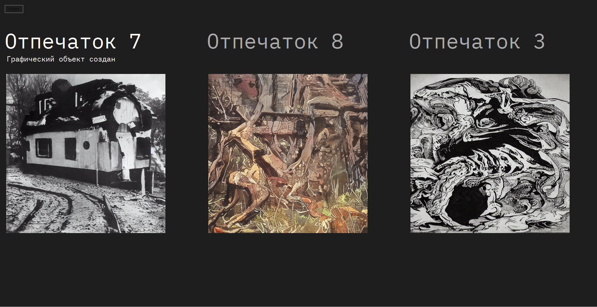

“W. Benjamin, you were wrong” is an art-project challenging the aesthetic idea of W. Benjamin that technological progress degrades art.

Benjamin declared that technological progress makes art easily reproducible and decreases its Exhibition Value. This project contradicts this take by:

- Guarantee of uniqueness for each art piece. The program connects quickly generated graphics with users’ fingerprints. They are transformed into unique tokens that can be provided only by a particular person. The program showcases the image again only when the person provides the fingerprint.
- The piece of art is exhibited only temporarily when a user gives their contest by providing a fingerprint. The initial project is exhibited in Moscow MoMA.

# Usage

**To run this project, you’ll need a fingerprint scanner ZK 9500.**

## Requirements

- Fingerprint scanner ZK 9500
- OS Windows 7/10/11
- .NET 4.7

## Instruction

1. Run `setup.exe` and install the ZKTeco driver.
2. Run `./start_exe/demo.exe`, plug the scanner and press `STArt`.
3. Place the finger on a scanner and follow the instructions of the screen.

You can display your own images. Name them with numbers beginning from `1.png` and place to the folder `start_pics`.

# Project description

## GUI

The interface is built as a Windows form based on [ZKTeco SDK](https://zkteco.eu/downloads/zkfinger-sdk-v100-zk9500-usb-reader). If the fingerprint cannot be identified on capture, the interface requires to put the finger 3 more times for registration and then shows the associated generative image in the left part of the screen. If the finger is identified, the image is demonstrated immediately. The two recent images are shown in the middle and right parts of the screen.

## Image generation

The images are generated with [this CLOOB-conditioned Latent Diffusion model](https://github.com/giganttheo/distill-ccld) trained on WikiArt dataset.
The uploaded image set is a demo version of the set exploited in the initial installation.

# Future improvements

- Connect the database collecting fingerprint templates coordinated with images.
- Add real-time image synthesis.
- Train the image-to-image diffusion model generating images from fingerprint embeddings.

# Acknowledgements

Project sponsored by the Development fund of **Moscow Polytechnique Museum**.

Installation is showcased at the exhibition “Forms of Dialogue” in **Moscow MoMA** from 8-Sep-2023 to 15-Oct-2023.

Special thanks to **Cassiopeia Sulla** for UX consultations and help with embodying the project.

Authors: **Antonina Alekseeva, Maxim Gospodinko**.